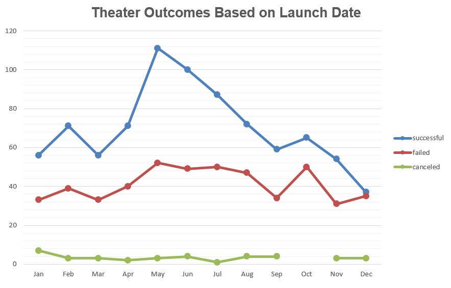
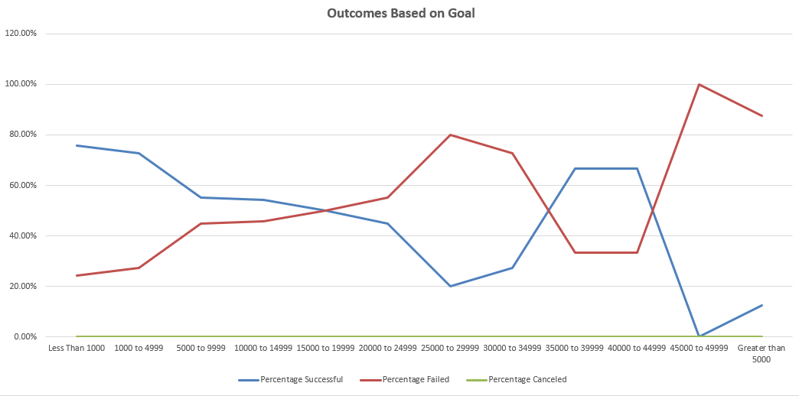

# Kickstarter-Analysis

## Overview of Project
  The Goal of this project is to analyze all the play fundraising goals throughout the years to see how they compared to Louise's play Fever. This Project will include visuals that will easily show the difference how each play easily surpassed their fundraising goal and others failing while having a high goal to reach.

## Analysis and Challenges
  After compiling the data and looking at the results, it shows that Theater plays that start between the end of springs and early summer will have a high success rate. The data also shows that fundraisers that end late fall and mid-winter will have a low success rate. I've also compiled the data based on how much was needed to fundraise the plays and compared it to the success, failure, and canceled rate. From the visual data alone, it tells me that the lower amount the goal, the higher the chance the play will succeed.

### Analysis of Outcomes Based on Launch Date

### Analysis of Outcomes Based on Goals

### Challenges and Difficulties Encountered
  I wanted to include some data with plays being canceled, but the data shows all fundraisers were either successful or failed. Also have difficulty displaying the fact that even though plays had a 32% success rate of a goal above $25000, the data shows only 12 shows were successful. Plays that had goals below 25000 had a success rate of 58% and 682 plays were successful. 

## Results
  From the data, it's concluded that a campaign becomes successful by holding the fundraiser between Late April and July. Also, campaigns  tend to fail more in October and the success rate is the lowest in Decemeber. We can also conclude based on the outcomes based on goal chart that plays will have a high success with a goal between 1 to 24999. Ccampaigns needs to be careful not to set a goal above 25000 since that will more than likely fail. As I said from the difficulties encountered, cancelled plays were never shown in the data so I would suggest cancelling more campaigns if the goal needed is above 25000. Futhermore, making a more detailed graph will be beneficial since the significant difference between the goal below 25000 had 682 successful plays and above goal of 25000 had only 12 successful plays. I hope the data   can help your future decision on plays you want to fundraise.
  
